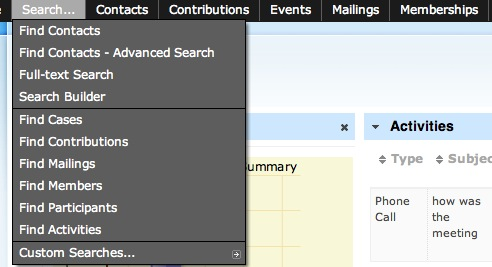

<!--
NOTA: Este README foi creado automáticamente por <https://github.com/YunoHost/apps/tree/master/tools/readme_generator>
NON debe editarse manualmente.
-->

# CiviCRM on Drupal 7 para YunoHost

[](https://ci-apps.yunohost.org/ci/apps/civicrm_drupal7/)  

[](https://install-app.yunohost.org/?app=civicrm_drupal7)

*[Le este README en outros idiomas.](./ALL_README.md)*

> *Este paquete permíteche instalar CiviCRM on Drupal 7 de xeito rápido e doado nun servidor YunoHost.*  
> *Se non usas YunoHost, le a [documentación](https://yunohost.org/install) para saber como instalalo.*

## Vista xeral

Open source constituent relationship management (CRM) for non-profits, NGOs and advocacy organizations.

The LDAP module is not installed by default, but can be installed.


**Versión proporcionada:** 5.69.4~ynh2

**Demo:** <https://civicrm.org/demo>

## Capturas de pantalla



## Documentación e recursos

- Web oficial da app: <https://civicrm.org/>
- Documentación oficial para admin: <https://docs.civicrm.org/>
- Repositorio de orixe do código: <https://github.com/civicrm/civicrm-drupal>
- Tenda YunoHost: <https://apps.yunohost.org/app/civicrm_drupal7>
- Informar dun problema: <https://github.com/YunoHost-Apps/civicrm_drupal7_ynh/issues>

## Info de desenvolvemento

Envía a túa colaboración á [rama `testing`](https://github.com/YunoHost-Apps/civicrm_drupal7_ynh/tree/testing).

Para probar a rama `testing`, procede deste xeito:

```bash
sudo yunohost app install https://github.com/YunoHost-Apps/civicrm_drupal7_ynh/tree/testing --debug
ou
sudo yunohost app upgrade civicrm_drupal7 -u https://github.com/YunoHost-Apps/civicrm_drupal7_ynh/tree/testing --debug
```

**Máis info sobre o empaquetado da app:** <https://yunohost.org/packaging_apps>
